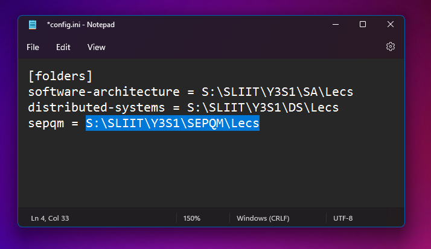

<h1 align="center">
  <a href="https://github.com/notnavindu/SLIIT-Eduscope-Video-Downloader">
    
  </a>
</h1>

<div align="center">
  <h1>Eduscope Video Downloader v0.2</h1>
  <br />
  <br />
  <a href="https://github.com/notnavindu/SLIIT-Eduscope-Video-Downloader/issues/new?assignees=&labels=bug&title=bug%3A+">Report a Bug</a>
  ·
  <a href="https://github.com/notnavindu/SLIIT-Eduscope-Video-Downloader/issues/new?assignees=&labels=enhancement&title=feat%3A+">Request a Feature</a>
  ·
  <a href="https://github.com/notnavindu/SLIIT-Eduscope-mods/">Chrome Extension</a>
</div>

<div align="center">
<br />


[](https://github.com/notnavindu)
[](https://hits.seeyoufarm.com)

</div>

<details open="open">
<summary>Table of Contents</summary>

- [About](#about)
  - [Built With](#built-with)
- [Getting Started](#getting-started)
  - [Prerequisites](#prerequisites)
  - [Installation Guide (For normal people)](#installation-guide-for-normal-people)
  - [Installation Guide (For tech savvy people)](#installation-guide-for-tech-savvy-people)
- [Troubleshooting](#troubleshooting)
- [Roadmap](#roadmap)
- [Contributing](#contributing)

</details>

---

## About

Basically, a python script to download eduscope videos (+ easy integration with [SLIIT Eduscope Mods Browser Extension](https://github.com/notnavindu/SLIIT-Eduscope-Mods). The download script is a modified version of @dinushka114's [script](https://github.com/dinushka114/eduscope-downloader)

**Demo**:

[](docs/demo.gif)

### Built With

- Python
- ffmpeg
- Chrome Native Messaging

## Getting Started

### Prerequisites

- You need the latest version of [SLIIT Eduscope Mods Browser Extension](https://github.com/notnavindu/SLIIT-Eduscope-Mods) before using this script.
- If you already have Eduscope mods, it should update to version 3.0 automatically (give it some time. maybe restart chrome)
- Chrome extension integration only works on windows. If you just need the downloader, check out the minimal script section. TODO:

### Installation Guide (For normal people)

1. Download the zip file. [Download link](https://github.com/notnavindu/SLIIT-Eduscope-Video-Downloader/releases/download/v0.2/SLIIT-Eduscope-downloader-v0.2.rar)
2. Unzip/extract the file to where you want to install this software. _(Don't move the extracted files after you `install` it completely)_
3. Open the `install.bat` file.
4. Open the `config.ini` file using the notepad.
5. Add the names of the modules/courses you follow along with the path of the folder you want to download lectuers. _(You can get the file path from file explorer and paste it here)_

Copy the path like this:


Add it to `config.ini` like this:



6. You can adjust the configuration however you want. Here are some sample configuration examples

example 1:

```ini
[folders]
software-architecture = S:\SLIIT\Y3S1\SA\Lecs
distributed-systems = S:\SLIIT\Y3S1\DS\Lecs
sepqm = S:\SLIIT\Y3S1\SEPQM\Lecs
```

example 2:

```ini
[folders]
Y3S1 - Software Architecture = S:\SLIIT\Y3S1\SA\Lecs
Y3S1 - Distributed Systems = S:\SLIIT\Y3S1\DS\Lecs
Y3S1 - SEPQM = S:\SLIIT\Y3S1\SEPQM\Lecs
```

7. Click "Download video" from the Eduscope Mods Google Chrome extension

### Installation Guide (For tech savvy people)

1. Download the release zip. [Download link](https://github.com/notnavindu/SLIIT-Eduscope-Video-Downloader/releases/download/v0.2/SLIIT-Eduscope-downloader-v0.2.rar)
2. Run `install.bat`
3. Configure using `config.ini`
4. Regenerate SHA256 nuclear launch codes
5. Click "Download Video" on Eduscope Mods Chrome extension
6. Well, that's it.

## Troubleshooting

If you keep getting redirecting here instead of downloading the video, try the following

1. Restart your computer (Obviously)
2. Update Google Chrome
3. Open the windows registry editor and check if you have `com.navindu.eduscope` in `Computer\HKEY_CURRENT_USER\Software\Google\Chrome\NativeMessagingHosts\`
4. Reach out to me on [IG](https://instagram.com/notnav.jpg), [twitter](https://twitter.com/notnavindu) or create a new [issue](https://github.com/notnavindu/SLIIT-Eduscope-Video-Downloader/issues)

## Roadmap

- **_GUI_**: No plans for GUI because CLI is way cooler 😎
- Feature requests are welcome

## Contributing

First off, thanks for taking the time to contribute! Contributions are what makes the open-source community such an amazing place to learn, inspire, and create. Any contributions you make will benefit everybody else and are **greatly appreciated**.

Please try to create bug reports that are:

- _Reproducible._ Include steps to reproduce the problem.
- _Specific._ Include as much detail as possible: which version, what environment, etc.
- _Unique._ Do not duplicate existing opened issues.
- _Scoped to a Single Bug._ One bug per report.
